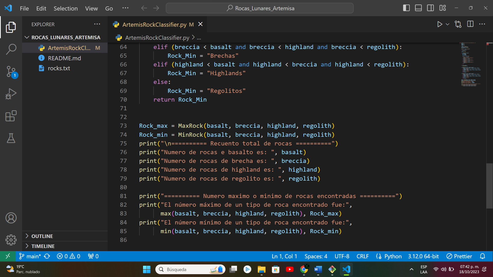

# Presentación

El propósito de este repositorio es llevar a cabo **una clasificación de los diversos tipos de rocas lunares.** Se logra mediante la **lectura de un archivo de texto** que contiene un registro detallado de estas rocas lunares. El código desarrollado tiene la **capacidad de procesar y clasificar estos registros en función de su tipo de roca.** Al finalizar, proporciona un informe que incluye un **recuento total de las rocas encontradas por cada tipo,** además de destacar el tipo de roca que tuvo el **conteo máximo y el mínimo** en el archivo de texto.

<h1 align="center"> Clasificación de tipos de rocas lunares "Proyecto Artemisa"</h1>

 Pantalla principal de la interfaz 

# Tabla de contenidos:

---

- [Badges](#badges)
- [Capturas de pantalla](#capturas-de-pantalla)
- [Descripción del proyecto](#descripción-del-proyecto)
- [Herramientas utilizadas](#herramientas-utilizadas)
- [Guía de instalación](#guía-de-instalación)
- [Autor](#autores)
- [Información adicional](#información-adicional)

# Badges

---

- Estado del proyecto: 
- Versión actual: 
- Uso de dependencias: 
- Tipo de proyecto: 
- Categoría del proyecto: 

# Capturas de pantalla

---

Las capturas de pantalla a continuación destacan puntos clave en el procesamiento y clasificación de datos del "Proyecto Artemisa".

## Capturas de pantalla del código en Python

## Capturas de pantalla del archivo de texto

# Descripción del proyecto

---

El proyecto es un programa de **escaneo y análisis de rocas lunares implementado en Python.** Su función es **leer datos de un archivo de texto** que contiene información sobre rocas lunares, analizar las rocas para determinar su tipo (Basalto, Brecha, Highlands o Regolito) y **contar cuántas rocas de cada tipo** se encuentran en el archivo.

1. **Lectura de archivo:** Lee un archivo de texto llamado "rocks.txt" que contiene información sobre las rocas lunares.
2. **Visualización de contenido:** Lee y muestra el contenido del archivo de texto línea por línea.
3. **Clasificación de rocas:** Clasifica cada roca lunar en una de las siguientes categorías: Basalto, Brecha, Highland o Regolito.
4. **Conteo de rocas:** Cuenta cuántas rocas de cada tipo se encuentran en el archivo y muestra un mensaje indicando que se encontró una roca de un tipo específico.
5. **Identificación de mínimo y máximo:** Determina el tipo de roca con el recuento máximo y mínimo.
6. **Resumen de conteo total:** Muestra el recuento total de rocas de cada tipo.
7. **Recuento de máximo y mínimo:** Muestra el número máximo y mínimo de un tipo de roca encontrado en el archivo, junto con su nombre correspondiente (Basaltos, Brechas, Highlands o Regolitos).

# Herramientas utilizadas

---

- [Visual Studio Code](https://code.visualstudio.com/)
- [Python](https://www.python.org/)
- [Archivos TXT](https://support.microsoft.com/es-es/windows/extensiones-de-nombre-de-archivo-comunes-en-windows-da4a4430-8e76-89c5-59f7-1cdbbc75cb01)
- [ColorCode](https://htmlcolorcodes.com/es/)
- [Shields.io](https://shields.io/badges/static-badge)

# Guía de instalación

---

¡Bienvenido al repositorio del proyecto de base de datos de la 'Tintorería Aries'! A continuación, encontrarás una guía paso a paso para descargar, configurar la base de datos y comenzar a trabajar con este proyecto en NetBeans.

1. **Descargar el Repositorio:**

   - Ve al repositorio en GitHub: https://github.com/Josmar360/Tintoreria_Aries_BD
   - Haz clic en el botón verde "Code" y selecciona "Download ZIP".
   - Descomprime el archivo ZIP en la ubicación de tu elección.

2. **Iniciar el proyecto en Visual Studio Code:**

   1. **Descargar e Instalar Visual Studio Code:**

      - Si aún no tienes Visual Studio Code instalado, puedes descargarlo desde el sitio web oficial de Visual Studio Code en https://code.visualstudio.com/. Sigue las instrucciones de instalación para tu sistema operativo.

   2. **Abrir Visual Studio Code:**

      - Abre Visual Studio Code en tu computadora. Deberías ver la ventana principal de VSCode.

   3. **Instalar la Extensión de Python (Opcional):**

      - Si planeas trabajar con Python en VSCode, te recomiendo instalar la extensión de Python para obtener funcionalidades adicionales. Para hacerlo, sigue estos pasos:
        1. Haz clic en la pestaña de "Extensions" (Extensiones) en el menú lateral izquierdo (ícono de cubos).
        2. Busca "Python" en el campo de búsqueda.
        3. Haz clic en la extensión "Python" proporcionada por Microsoft y haz clic en el botón "Install" (Instalar).

   4. **Abrir una Carpeta en VSCode:**

      - Para abrir una carpeta en VSCode, puedes hacer lo siguiente:
        1. En la pantalla principal de VSCode, verás un ícono de carpeta en la esquina izquierda superior. Haz clic en este ícono o usa Ctrl+K Ctrl+O en Windows/Linux o Cmd+K Cmd+O en macOS.
        2. Se abrirá un cuadro de diálogo que te permitirá seleccionar una carpeta en tu sistema. Navega hasta la carpeta que deseas abrir y selecciona la carpeta principal. Luego, haz clic en el botón "Select Folder" (Seleccionar Carpeta).

   5. **Explorador de Carpetas:**

      - Una vez que hayas seleccionado una carpeta, la carpeta se abrirá en el "Explorador de Carpetas" en la sección izquierda de VSCode. Aquí podrás ver y explorar todos los archivos y subcarpetas en esa carpeta.

   6. **Crear o Abrir Archivos de Python:**

      - Para trabajar con archivos Python en tu carpeta, puedes crear un nuevo archivo Python o abrir uno existente. Haz clic en el ícono de archivo en la parte superior del "Explorador de Carpetas" y selecciona "New File" (Nuevo Archivo) para crear uno nuevo o "Open File" (Abrir Archivo) para abrir un archivo existente.

   7. **Escribir y Ejecutar Código:**
      - Ahora estás listo para escribir y ejecutar código Python en VSCode. Puedes abrir un archivo Python existente o crear uno nuevo en la carpeta que has abierto. Luego, escribe tu código en el editor y utiliza las funcionalidades de VSCode, como la extensión de Python, para ejecutar y depurar tu código.

# Autor/es

---

[Josmar Gustavo Palomino Castelan](https://linktr.ee/josmar360)

# Información adicional

---

El propósito de este proyecto es adquirir habilidades en el escaneo y análisis de datos provenientes de archivos de texto. Para lograrlo, se recomienda tomar el curso "Introducción a Python para la Exploración Espacial", disponible en Microsoft Learn en colaboración con la NASA. Este curso se centra en la aplicación de Python para analizar datos relacionados con la exploración espacial. Para visualizar el curso [Da clic aquí](https://learn.microsoft.com/en-us/training/modules/introduction-python-nasa/)

- [Regresar al inicio](#presentación)
